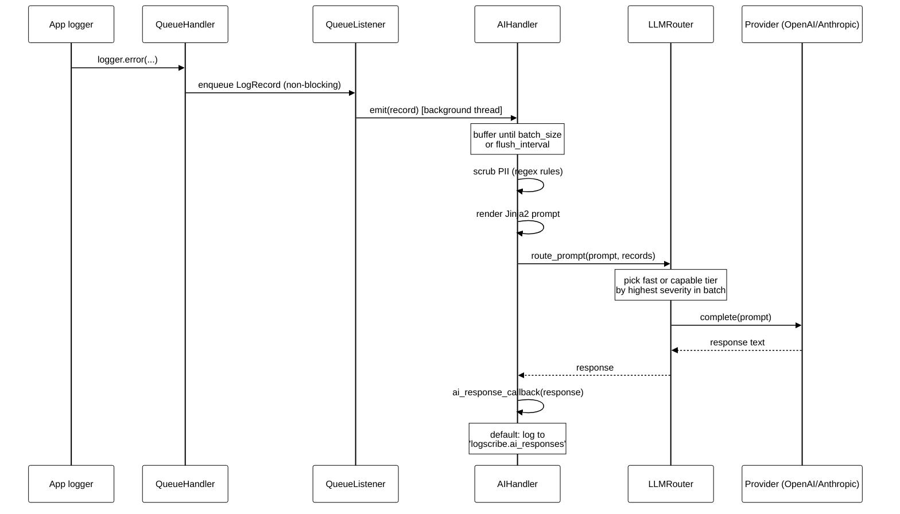

# logscribe

**logscribe — an AI lens on your logs. Batches your Python logs, scrubs PII, and asks an LLM what's going on.**

[](https://github.com/nadeem4/logscribe/actions/workflows/ci.yml)
[](LICENSE)

## Quickstart

```python
import logging
from logscribe import AIHandler, get_async_logging_setup

logging.basicConfig(level=logging.INFO)  # AI responses log at INFO -- see note below

ai_handler = AIHandler(level=logging.WARNING)
queue_handler, listener = get_async_logging_setup(ai_handler)
logging.getLogger("my_app").addHandler(queue_handler)
listener.start()
logging.getLogger("my_app").error("payment service timeout for order 8812")

listener.stop()
ai_handler.close()  # drains the buffer and blocks (bounded timeout) until the batch is sent
```

`AIHandler` needs a provider API key to actually call an LLM — set `OPENAI_API_KEY` (or `ANTHROPIC_API_KEY` and `LOGSCRIBE_PROVIDER=anthropic`) in the environment first. Without a key, the snippet above still runs end-to-end (batching, PII scrubbing, prompt rendering) but `route_prompt()` returns `None` and nothing is sent anywhere — see [Configuration reference](#configuration-reference).

**The AI response is logged at `INFO` to the `logscribe.ai_responses` logger, and is invisible unless that logger (or the root logger, as above) is enabled at `INFO` or lower** — with default logging config it's silently swallowed by root's default `WARNING` level. The `listener.stop()` / `ai_handler.close()` pair at the end is not optional either: without it, a script that isn't attached to a terminal (output redirected to a file, a container, a systemd unit, `python app.py > out.log`) can exit via `logging.shutdown()` before the background worker has dequeued and sent the batch, silently dropping it. With a working provider key, the last line of output looks like this:

```
2024-01-15 10:23:04,112 - AI_RESPONSE - Root cause: order 8812 timed out waiting on the payment gateway (3.2s). Suggested action: check gateway latency dashboards; consider raising the client timeout.
```

## ⚠️ Privacy — read this first

Logs handled by `AIHandler` are sent to a third-party AI provider (OpenAI or Anthropic). PII scrubbing is **on by default** but is **regex-based and best-effort**: it catches emails, IPv4 addresses, and common Visa/Mastercard/Amex card numbers. It will **not** catch person names, physical addresses, or secrets embedded in free-text messages (API keys, passwords, tokens pasted into a log line, etc.).

- Don't attach `AIHandler` to loggers that handle regulated or highly sensitive data.
- Write custom PII rules and/or sample your log volume before it reaches `AIHandler`.
- The `local` extra installs `transformers`/`torch` as dependencies, but as of this release there is no on-device `LLMProvider` implementation that uses them — only `openai` and `anthropic` call out to an external API today. Don't install `[local]` expecting analysis to stay on-device.

Full detail — exactly what data leaves the machine, what scrubbing misses, how to write custom rules, and how to disable sending per-logger — is in **[docs/PRIVACY.md](docs/PRIVACY.md)**.

## How it works



`QueueHandler`/`QueueListener` move the work off the caller's thread; `AIHandler` itself also has its own internal background worker, so batching, PII scrubbing, prompt rendering, and the LLM call never block whatever thread called `logger.error(...)`, and a failing or slow provider never raises into the host application.

**`QueueHandler`/`QueueListener` vs. attaching `AIHandler` directly.** `AIHandler` already does its batching, scrubbing, and provider calls on its own background thread — you can call `logger.addHandler(AIHandler(...))` directly and never touch a queue. Do that for a script, a one-off tool, or anywhere a few microseconds of `emit()` overhead per log call (buffering the record, checking the batch size) is a non-issue. Add `get_async_logging_setup()`'s `QueueHandler`/`QueueListener` pair on top when the calling thread itself must never block on that `emit()` overhead — e.g. a request-handling thread in a web server under load, or any latency-sensitive hot path — since `QueueHandler.emit()` only puts the record on a queue and returns immediately, deferring everything else to the listener thread. The Quickstart above uses the queue form because it's the safer default to copy-paste; three of the four files in `examples/` attach `AIHandler` directly because they're simple scripts where the distinction doesn't matter.

## Installation

```bash
pip install "logscribe[openai]"       # OpenAI provider
pip install "logscribe[anthropic]"    # Anthropic provider
pip install "logscribe[metrics]"      # Prometheus metrics
pip install "logscribe[all]"          # openai + anthropic + metrics
```

The brackets must be quoted — on zsh (macOS's default shell since Catalina), an unquoted `pip install logscribe[openai]` fails with `zsh: no matches found` because zsh treats `[...]` as a glob pattern.

Core dependencies (`pydantic`, `pydantic-settings`, `Jinja2`) are always installed; the extras above are optional. Requires Python 3.10+.

## Configuration reference

All settings are environment variables (a `.env` file in the working directory is also read), defined in `logscribe/config/settings.py`. Provider API keys keep their conventional names rather than an `LOGSCRIBE_` prefix:

| Variable | Default | Description |
|---|---|---|
| `OPENAI_API_KEY` | *(none)* | OpenAI API key. Required to use the `openai` provider. |
| `ANTHROPIC_API_KEY` | *(none)* | Anthropic API key. Required to use the `anthropic` provider. |

| Variable | Default | Description |
|---|---|---|
| `LOGSCRIBE_DEFAULT_LEVEL` | `INFO` | Default level for `AILogger` (`logscribe.logger.AILogger`); read directly from the environment at import time, not through `get_settings()`. |
| `LOGSCRIBE_BATCH_SIZE` | `10` | Number of log records `AIHandler` buffers before flushing a batch. |
| `LOGSCRIBE_FLUSH_INTERVAL_SECONDS` | `5.0` | Seconds between periodic flushes, even if `LOGSCRIBE_BATCH_SIZE` hasn't been reached. |
| `LOGSCRIBE_MAX_RETRIES` | `3` | Max retry attempts for a failing AI provider call. |
| `LOGSCRIBE_RETRY_BACKOFF_FACTOR` | `2.0` | Backoff multiplier for retries: sleep is `factor * 2^attempt` seconds. |
| `LOGSCRIBE_CB_FAILURE_THRESHOLD` | `3` | Consecutive failed batches before the circuit breaker opens. |
| `LOGSCRIBE_CB_RESET_TIMEOUT_SECONDS` | `60.0` | Seconds the breaker stays OPEN before allowing one HALF_OPEN trial call. |
| `LOGSCRIBE_PROVIDER` | `openai` | Which provider `LLMRouter` builds: `openai` or `anthropic`. |
| `LOGSCRIBE_FAST_MODEL` | `gpt-4o-mini` | Model used for the fast tier. If `LOGSCRIBE_PROVIDER=anthropic` and this was never explicitly set, it defaults to `claude-3-5-haiku-latest` instead. |
| `LOGSCRIBE_CAPABLE_MODEL` | `gpt-4o` | Model used for the capable tier. If `LOGSCRIBE_PROVIDER=anthropic` and this was never explicitly set, it defaults to `claude-sonnet-4-5` instead. |
| `LOGSCRIBE_CAPABLE_SEVERITY_THRESHOLD` | `ERROR` | Minimum log level (of the highest-severity record in a batch) that routes to the capable tier instead of the fast tier. |
| `LOGSCRIBE_JINJA_TEMPLATE_DIR` | *(none)* | Directory to load a custom Jinja2 prompt template from. Falls back to the packaged `templates/` directory. |
| `LOGSCRIBE_JINJA_LOG_PROMPT_TEMPLATE_NAME` | `default_log_prompt.jinja2` | Template filename to render the batch into a prompt. |
| `LOGSCRIBE_PII_RULES_JSON` | *(none)* | JSON array of custom PII scrubbing rules, added on top of the defaults. See [docs/PRIVACY.md](docs/PRIVACY.md). |
| `LOGSCRIBE_PII_USE_DEFAULT_RULES` | `true` | Set to `false` to disable the built-in email/IPv4/card-number rules. |
| `LOGSCRIBE_AI_RESPONSE_HANDLER_TYPE` | `LOG` | Declared for future non-`LOG` response handling (`CALLBACK`/`FILE`/`NONE`); today `AIHandler` always calls its response callback (default: log to `LOGSCRIBE_AI_RESPONSE_LOG_LOGGER_NAME`) regardless of this value. |
| `LOGSCRIBE_AI_RESPONSE_LOG_LOGGER_NAME` | `logscribe.ai_responses` | Logger name the default response callback logs AI responses to. |
| `LOGSCRIBE_AI_RESPONSE_FILE_PATH` | *(none)* | Declared but not currently consumed by any code path — there is no file-based response handler implemented yet. |
| `LOGSCRIBE_PROMETHEUS_ENABLED` | `true` | Whether to build real Prometheus metrics (requires the `metrics` extra) instead of no-op stand-ins. |
| `LOGSCRIBE_PROMETHEUS_PORT` | `9095` | Port for `start_prometheus_server_if_enabled()`. |

## Routing

`LLMRouter` picks between two provider instances built from the same `LOGSCRIBE_PROVIDER`: a **fast** one (`LOGSCRIBE_FAST_MODEL`) and a **capable** one (`LOGSCRIBE_CAPABLE_MODEL`). For each batch, it takes the highest-severity record's level and compares it against `LOGSCRIBE_CAPABLE_SEVERITY_THRESHOLD` (default `ERROR`): at or above the threshold, the batch routes to the capable tier; below it, to the fast tier. If neither provider could be built (no key, or its SDK isn't installed), `route_prompt()` returns `None` and no call is made — the handler never raises.

## Metrics

With the `metrics` extra installed and `LOGSCRIBE_PROMETHEUS_ENABLED=true` (the default), `AIHandler` populates these Prometheus metrics (`logscribe.metrics.prometheus`):

| Metric | Type | Labels |
|---|---|---|
| `logscribe_handler_records_processed` | Counter | — |
| `logscribe_handler_batches_processed` | Counter | — |
| `logscribe_handler_batch_size_records` | Histogram | — |
| `logscribe_ai_calls` | Counter | `model`, `status` |
| `logscribe_ai_call_latency_seconds` | Histogram | `model` |
| `logscribe_ai_call_errors` | Counter | `model`, `error_type` |
| `logscribe_circuit_breaker_state_changes` | Counter | `model`, `new_state` |
| `logscribe_circuit_breaker_currently_open` | Gauge | `model` |

Two further metrics are registered but not yet populated by any code path: `logscribe_queue_depth_records` and `logscribe_pii_scrubbed_fields`. Without the `metrics` extra (or with it disabled), `AIHandler` uses no-op stand-ins and none of this is exposed. Start the exporter with `start_prometheus_server_if_enabled()`.

## When NOT to use it

- **High-volume hot paths without sampling.** `AIHandler` makes roughly one LLM call per batch (`LOGSCRIBE_BATCH_SIZE` records, or every `LOGSCRIBE_FLUSH_INTERVAL_SECONDS`). A busy service logging thousands of records/sec will generate a matching volume of paid LLM calls unless you sample before attaching the handler or raise the handler's `level`.
- **Regulated or highly sensitive data.** PII scrubbing is best-effort regex matching, not a compliance control — see [docs/PRIVACY.md](docs/PRIVACY.md).
- **Cost-sensitive environments without a cap.** There is no built-in spend limit; every flushed batch that clears the circuit breaker is a real API call to your configured provider.

## Health check

```bash
logscribe-check          # human-readable ✅/❌ report
logscribe-check --json   # single-line JSON to stdout
```

`ok` (and the `--json` field of the same name) means **AI logging will work with the currently configured provider** — it reflects only the provider named by `LOGSCRIBE_PROVIDER`, since `LLMRouter` only ever builds that one provider and never falls back to the other at runtime. The `providers` object separately reports both `openai` and `anthropic` state (`ok` / `no_key` / `sdk_missing`) regardless of which one is selected, so you can see what switching `LOGSCRIBE_PROVIDER` would give you.

A provider's `"ok"` means its API key is present and its SDK is importable — **not** that the key has been verified. There is no `invalid_key` state and `logscribe-check` makes no network call.

Two more things to know about the output:

- **The `metrics` line can read `❌` while `overall` reads `✅`.** Like the provider case above, `overall` doesn't roll up every line — a missing `prometheus_client` (`[metrics]` extra not installed) fails the `metrics` check without affecting `ok`/`overall`, since metrics are optional and unrelated to whether AI logging itself will work.
- **The `✅`/`❌` glyphs degrade to `[OK]`/`[FAIL]`** when stdout's encoding can't represent them — e.g. a Windows console still on the legacy `cp1252` codepage. `--json` output is unaffected either way.

## License

MIT License. See [LICENSE](LICENSE) for the full text.
